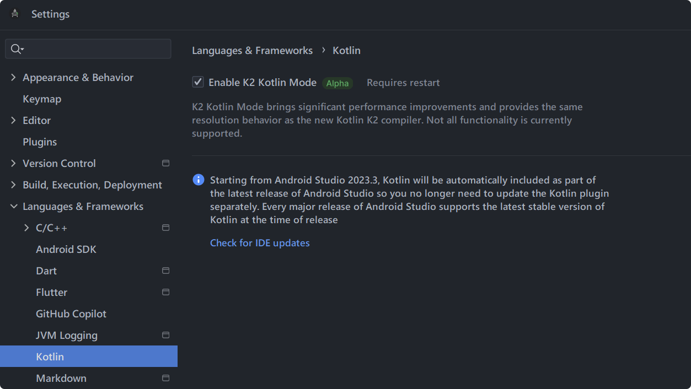
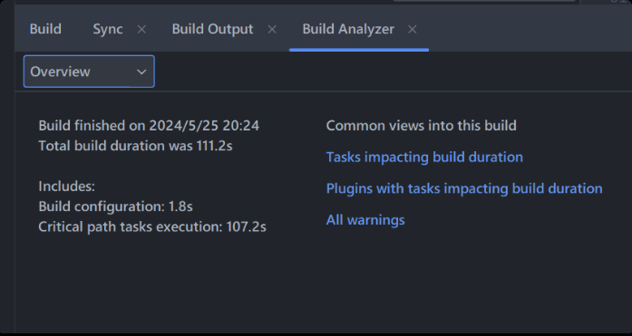
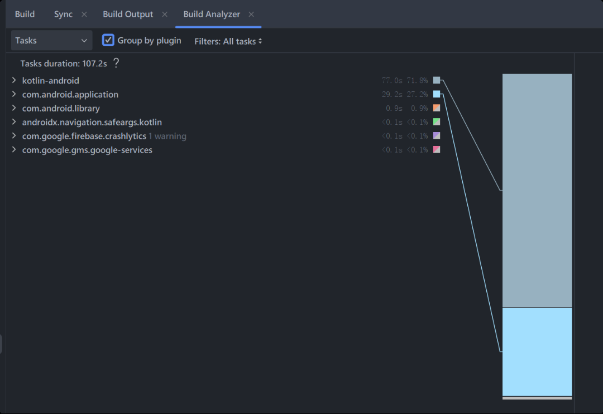
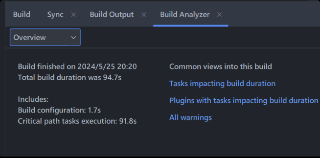
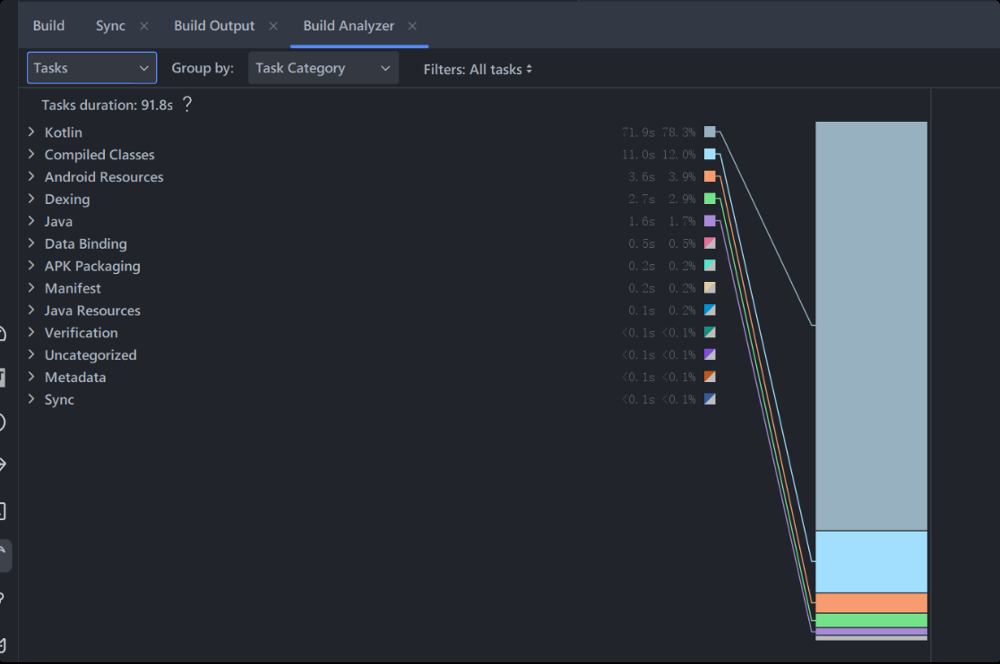

# 将人升迁移至 Kotlin 2.0

## 〇、背景

5月21号，Kotlin 发布了 2.0.0 版本，并且引入了 K2 编译器：

https://kotlinlang.org/docs/whatsnew20.html

根据官方的文档描述，带来了不少的智能推断优化和编译速度改进。

## 一、迁移

实际迁移步骤很简单，

1. 直接把 Kotlin 依赖版本修改为 2.0.0 即可。
2. 根据官网说明 gradle 版本最好也升级到 8.3 以上，使用 IDE 的升级助理升级到了 8.7 版本。
3. 但为了让 IDE 也能用上新编译器，也试了试把 IDE 升级到了考拉🐨版本。

I.png)

然后在设置中启用 K2。

除了上述的迁移外，根据 gradle 的废弃提示等等，为了优化数据：

- 更新了第三方依赖，将所有库都改为直接支持 AndroidX，然后将`android.enableJetifier`设为 false。
- 将`android.nonTransitiveRClass`设为了true，原本以为这会影响引用依赖的R文件。但实际上只需要加上完整包名依然能引用，而且 IDE 支持自动迁移。
- 将`android.nonFinalResIds`设为了true。
- 上述操作后，编译混淆出现了一些问题，也更新了一遍混淆文件。

## 二、编译速度表现

### Kotlin 1.8.22 + Gradle 7.4

13 代 i7 本地clean后重新编译、不混淆，**约 111.2s 完成编译**

### Kotlin 2.0.0 + Gradle 8.7

13 代 i7 本地clean后重新编译、不混淆，**约 94.7s 完成编译**

### 结论

升级后并且改进了相关配置，让编译速度提升了 16.5s（约15%）。

表现还是不错的。

但是期间也试过使用 Github Runner 跑脚本打包，表现有些差异，可能跟缓存、混淆流程、需要上传 mapping 等有关。未细究。